# 03 · Diagrams

Every diagram below is **rendered as a PNG in [`figures/`](figures/)** and shown here as an image, with the Mermaid
source kept underneath it in a collapsed block. The source is the master: edit it, then re-render with

```bash
npx -y @mermaid-js/mermaid-cli -i docs/figures/<name>.mmd -o docs/figures/<name>.png -b white -s 3
```

(`-s 3` is the scale — the PNGs are ~3× density, so they stay sharp on a slide or in print. On Windows, point
puppeteer at the installed Chrome rather than letting it download one.)

**For the presentation deck, use §3, §4a and §5.** §3 is the argument for a crew, §4a is the crew itself, §5 is the
access gate. §4d is the honest answer to "did the agents actually do anything?" — a real trace from a live run.

---

## 1. System context

Who talks to the system, and what crosses each boundary.

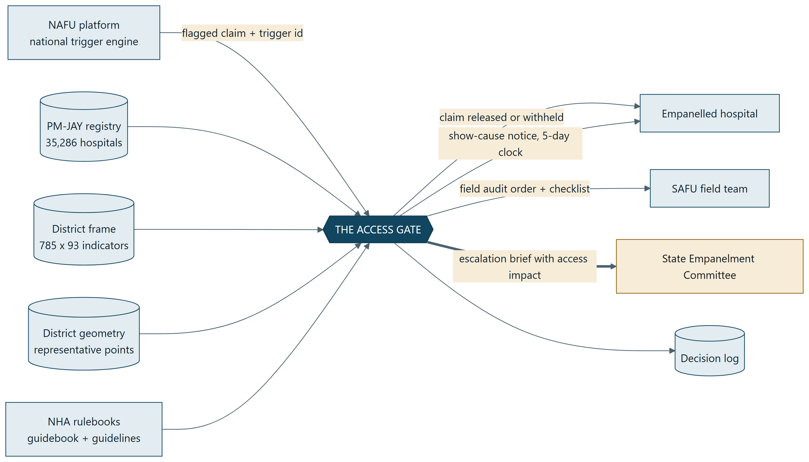

<details><summary>Mermaid source (the figure is rendered from this)</summary>

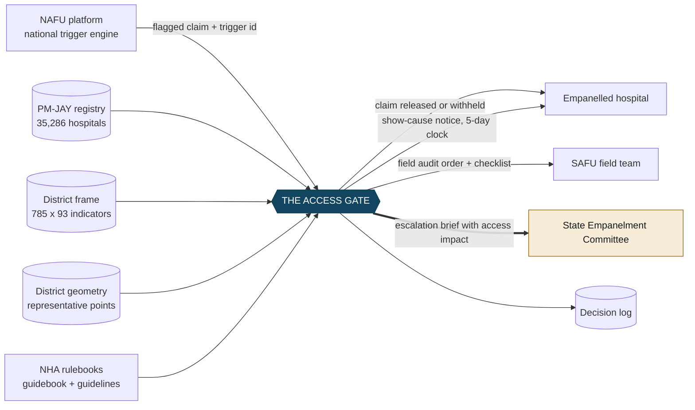
```mermaid
flowchart LR
    NAFU["NAFU platform<br/>national trigger engine"]
    REG[("PM-JAY registry<br/>35,286 hospitals")]
    DIST[("District frame<br/>785 x 93 indicators")]
    GEO[("District geometry<br/>representative points")]
    RULE["NHA rulebooks<br/>guidebook + guidelines"]

    SYS{{"THE ACCESS GATE"}}

    HOSP["Empanelled hospital"]
    SAFU["SAFU field team"]
    SEC["State Empanelment Committee"]
    LOG[("Decision log")]

    NAFU -->|flagged claim + trigger id| SYS
    REG --> SYS
    DIST --> SYS
    GEO --> SYS
    RULE --> SYS

    SYS -->|claim released or withheld| HOSP
    SYS -->|show-cause notice, 5-day clock| HOSP
    SYS -->|field audit order + checklist| SAFU
    SYS ==>|escalation brief with access impact| SEC
    SYS --> LOG

    style SYS fill:#12455f,stroke:#0d3a50,color:#ffffff
    style SEC fill:#f6ecd8,stroke:#8f6212,color:#14191d
```

</details>

---

## 2. Component architecture

Five layers. **Only L3 contains agents**, and the policy decides between them.

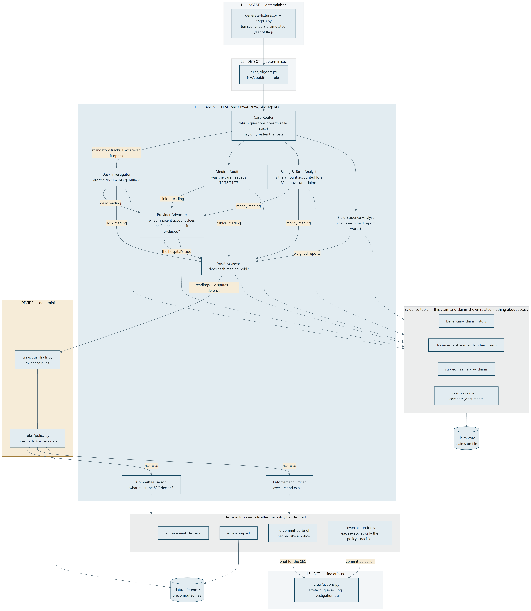

<details><summary>Mermaid source (the figure is rendered from this)</summary>

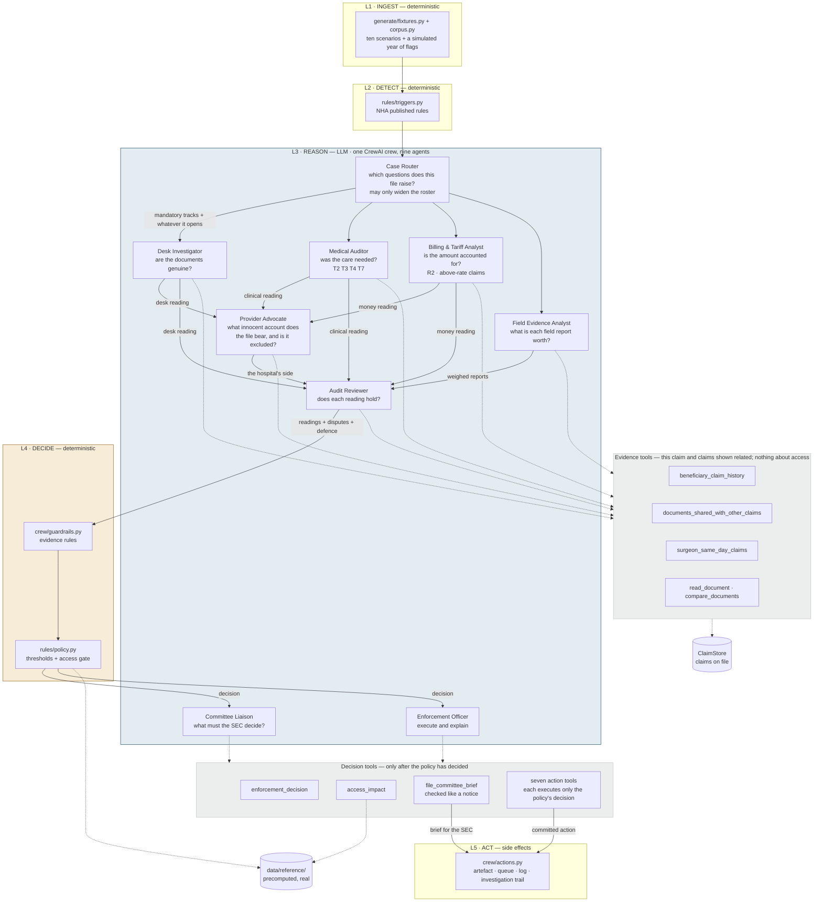
```mermaid
flowchart TD
    subgraph L1["L1 · INGEST — deterministic"]
        GEN["generate/fixtures.py + corpus.py<br/>ten scenarios + a simulated year of flags"]
    end

    subgraph L2["L2 · DETECT — deterministic"]
        TRG["rules/triggers.py<br/>NHA published rules"]
    end

    subgraph L3["L3 · REASON — LLM · one CrewAI crew, nine agents"]
        RTR["Case Router<br/>which questions does this file raise?<br/>may only widen the roster"]
        INV["Desk Investigator<br/>are the documents genuine?"]
        MED["Medical Auditor<br/>was the care needed?<br/>T2 T3 T4 T7"]
        BIL["Billing &amp; Tariff Analyst<br/>is the amount accounted for?<br/>R2 · above-rate claims"]
        FLD["Field Evidence Analyst<br/>what is each field report worth?"]
        ADV["Provider Advocate<br/>what innocent account does<br/>the file bear, and is it excluded?"]
        REV["Audit Reviewer<br/>does each reading hold?"]
        LIA["Committee Liaison<br/>what must the SEC decide?"]
        OFF["Enforcement Officer<br/>execute and explain"]
    end

    subgraph ETOOLS["Evidence tools — this claim and claims shown related; nothing about access"]
        E1["beneficiary_claim_history"]
        E2["documents_shared_with_other_claims"]
        E3["surgeon_same_day_claims"]
        E4["read_document · compare_documents"]
    end

    subgraph OTOOLS["Decision tools — only after the policy has decided"]
        O1["enforcement_decision"]
        O2["access_impact"]
        O4["file_committee_brief<br/>checked like a notice"]
        O3["seven action tools<br/>each executes only the policy's decision"]
    end

    subgraph L4["L4 · DECIDE — deterministic"]
        GRD["crew/guardrails.py<br/>evidence rules"]
        POL["rules/policy.py<br/>thresholds + access gate"]
    end

    subgraph L5["L5 · ACT — side effects"]
        ACT["crew/actions.py<br/>artefact · queue · log · investigation trail"]
    end

    CLAIMS[("ClaimStore<br/>claims on file")]
    REF[("data/reference/<br/>precomputed, real")]

    GEN --> TRG --> RTR
    RTR -->|"mandatory tracks + whatever it opens"| INV
    RTR --> MED
    RTR --> BIL
    RTR --> FLD
    INV -.-> ETOOLS
    MED -.-> ETOOLS
    BIL -.-> ETOOLS
    FLD -.-> ETOOLS
    REV -.-> ETOOLS
    ADV -.-> ETOOLS
    ETOOLS -.-> CLAIMS
    INV -->|desk reading| ADV
    MED -->|clinical reading| ADV
    BIL -->|money reading| ADV
    ADV -->|"the hospital's side"| REV
    INV -->|desk reading| REV
    MED -->|clinical reading| REV
    BIL -->|money reading| REV
    FLD -->|weighed reports| REV
    REV -->|readings + disputes + defence| GRD --> POL
    POL -->|decision| LIA
    POL -->|decision| OFF
    LIA -.-> OTOOLS
    OFF -.-> OTOOLS
    O2 -.-> REF
    POL -.-> REF
    O4 -->|brief for the SEC| ACT
    O3 -->|committed action| ACT

    style L3 fill:#e2ecf1,stroke:#12455f
    style L4 fill:#f6ecd8,stroke:#8f6212
    style ETOOLS fill:#eceded,stroke:#bfc3c8
    style OTOOLS fill:#eceded,stroke:#bfc3c8
```

</details>

**Read the arrow types.** Solid arrows are the pipeline; dotted arrows are tool calls and reads. The four readers work
from the same case, independently: no reader sees another's finding, and their evidence tools reach the claims on file
and never the access data. The advocate and the reviewer do receive the readings — one to answer them, one to check
them — and the router receives none of them, because it runs first and is given no evidence tool at all. Only the two
agents that act on the decision can read the access data. Every agent's tool calls are recorded in the investigation
trail that every artefact carries.

---

## 3. Agentic flowchart ★

**This is the diagram that answers "why CrewAI and not a script?"** The upper branches are taken by the agents,
each choosing what evidence its own question needs; the lower one by the policy, according to *who else can treat
these patients*.


<details><summary>Mermaid source (the figure is rendered from this)</summary>

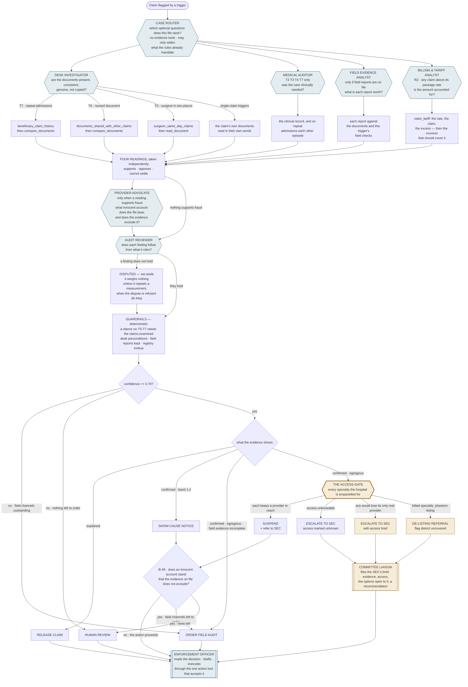
```mermaid
flowchart TD
    START(["Claim flagged by a trigger"]) --> RTR

    RTR{{"CASE ROUTER<br/>which optional questions does this file raise?<br/>no evidence tools · may only widen<br/>what the rules already mandate"}}
    RTR --> INV
    RTR --> MED
    RTR --> FLD
    RTR --> BIL

    INV{{"DESK INVESTIGATOR<br/>are the documents present, consistent,<br/>genuine, not copied?"}}

    INV -->|"T7 · repeat admissions"| H["beneficiary_claim_history<br/>then compare_documents"]
    INV -->|"T6 · reused document"| S["documents_shared_with_other_claims<br/>then compare_documents"]
    INV -->|"T5 · surgeon in two places"| U["surgeon_same_day_claims<br/>then read_document"]
    INV -->|"single-claim triggers"| D["the claim's own documents<br/>read in their own words"]

    MED{{"MEDICAL AUDITOR<br/>T2 T3 T4 T7 only<br/>was the care clinically needed?"}}
    MED --> M1["the clinical record, and on repeat<br/>admissions each other episode"]

    FLD{{"FIELD EVIDENCE ANALYST<br/>only if field reports are on file<br/>what is each report worth?"}}
    FLD --> F1["each report against<br/>the documents and this trigger's<br/>field checks"]

    BIL{{"BILLING &amp; TARIFF ANALYST<br/>R2 · any claim above its package rate<br/>is the amount accounted for?"}}
    BIL --> B1["claim_tariff: the rate, the claim,<br/>the excess — then the invoices<br/>that should cover it"]

    H --> REP
    S --> REP
    U --> REP
    D --> REP

    REP["FOUR READINGS, taken independently<br/>supports · opposes · cannot settle"] --> ADV
    M1 --> REP
    F1 --> REP
    B1 --> REP

    ADV{{"PROVIDER ADVOCATE<br/>only when a reading supports fraud<br/>what innocent account does the file bear,<br/>and does the evidence exclude it?"}}
    REP -->|"nothing supports fraud"| REV
    ADV --> REV

    REV{{"AUDIT REVIEWER<br/>does each finding follow<br/>from what it cites?"}}
    REV -->|"a finding does not hold"| DIS["DISPUTED — set aside<br/>it weighs nothing<br/>unless it repeats a measurement,<br/>when the dispute is refused (B-44a)"]
    REV -->|"they hold"| GR
    DIS --> GR

    GR["GUARDRAILS — deterministic<br/>a stance on T5-T7 needs the claims examined<br/>desk preconditions · field reports kept · registry lookup"] --> FLOOR

    FLOOR{"confidence >= 0.70?"}
    FLOOR -->|"no · field channels outstanding"| X3["ORDER FIELD AUDIT"]
    FLOOR -->|"no · nothing left to order"| X1["HUMAN REVIEW"]
    FLOOR -->|yes| SEV

    SEV{"what the evidence shows"}
    SEV -->|"explained"| X0["RELEASE CLAIM"]
    SEV -->|"confirmed · band 1-2"| X2["SHOW-CAUSE NOTICE"]
    SEV -->|"confirmed · egregious · field evidence incomplete"| X3
    SEV -->|"confirmed · egregious"| GATE

    GATE{{"THE ACCESS GATE<br/>every specialty the hospital is empanelled for"}}

    GATE -->|"each keeps a provider in reach"| X4["SUSPEND<br/>+ refer to SEC"]
    GATE -->|"access unknowable"| X5["ESCALATE TO SEC<br/>access marked unknown"]
    GATE -->|"any would lose its only real provider"| X6["ESCALATE TO SEC<br/>with access brief"]
    GATE -->|"billed specialty: phantom listing"| X7["DE-LISTING REFERRAL<br/>flag district uncovered"]

    X2 & X4 --> DEF
    DEF{"B-49 · does an innocent account stand<br/>that the evidence on file does not exclude?"}
    DEF -->|"no · the action proceeds"| OFF
    DEF -->|"yes · field channels left to order"| X3
    DEF -->|"yes · none left"| X1

    X5 & X6 & X7 --> LIA

    LIA[["COMMITTEE LIAISON<br/>files the SEC's brief: evidence, access,<br/>the options open to it, a recommendation"]]

    X0 & X1 & X3 --> OFF
    LIA --> OFF

    OFF[["ENFORCEMENT OFFICER<br/>reads the decision · drafts · executes<br/>through the one action tool that accepts it"]]

    style RTR fill:#e2ecf1,stroke:#12455f
    style INV fill:#e2ecf1,stroke:#12455f
    style MED fill:#e2ecf1,stroke:#12455f
    style FLD fill:#e2ecf1,stroke:#12455f
    style BIL fill:#e2ecf1,stroke:#12455f
    style ADV fill:#e2ecf1,stroke:#12455f
    style REV fill:#e2ecf1,stroke:#12455f
    style LIA fill:#f6ecd8,stroke:#8f6212
    style OFF fill:#e2ecf1,stroke:#12455f
    style GATE fill:#f6ecd8,stroke:#8f6212,stroke-width:3px
    style X6 fill:#f6ecd8,stroke:#8f6212
    style X7 fill:#f6ecd8,stroke:#8f6212
```

</details>

**Two branches, two different kinds.** The upper one is *epistemic*: which questions does this file raise, what does
the evidence show, does each finding hold, and is there an innocent account it will bear? The agents take that branch,
and every tool they call is recorded. The lower one is *ethical*: what happens to patients if we act? Only the policy
takes it; the liaison prepares the Committee that decides the escalated cases, and the officer can execute nothing but
the policy's decision.

**Three things the agents cannot do here.** The router may only *widen* the investigation, never narrow what the rules
mandate. The advocate may only *slow* a case — a defence never reaches RELEASE, and never stops an escalation, which
is already going to the Committee. The reviewer may only *dispute*, and not even that when the reading repeats a
measurement the claim store made itself.

---

## 4. Sequence — one case end to end

Test scenario 2: the Bahraich cardiology case, as the crew runs it.


<details><summary>Mermaid source (the figure is rendered from this)</summary>

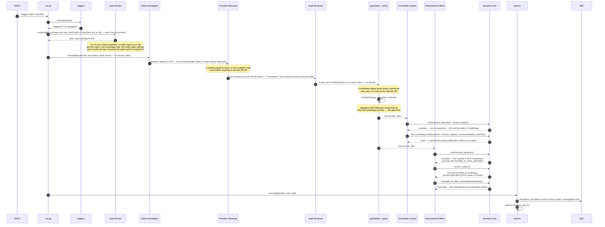
```mermaid
sequenceDiagram
    autonumber
    participant N as NAFU
    participant R as run.py
    participant T as triggers
    participant C as Case Router
    participant I as Desk Investigator
    participant P as Provider Advocate
    participant V as Audit Reviewer
    participant G as guardrails + policy
    participant L as Committee Liaison
    participant O as Enforcement Officer
    participant TL as Decision tools
    participant A as actions
    participant S as SEC

    N->>R: flagged claim CLM-S02
    R->>T: evaluate(claim)
    T-->>R: TriggerHit T10, egregious
    R->>C: route(trigger, package and rate, what kinds of document are on file — never the documents)
    C-->>R: plan: open nothing further
    Note over C: T10 is not a clinical question, no field report is on file<br/>and the claim is at its package rate: the router adds nothing,<br/>and it could not have removed the desk audit if it wanted to
    R->>I: investigate(case file: documents, desk checks — no access data)
    I-->>P: reading: supports, 0.95 — the certificate dates death 13 days before admission
    Note over P: a reading supports fraud, so the hospital's side<br/>is put before anything is decided (B-49)
    P-->>V: the innocent account the file bears — **excluded**: the certificate itself carries the date
    V-->>G: review: each finding follows from what it cites — no dispute
    Note over G: a certificate dating death before admission<br/>may carry T10 without the field (B-28)
    G->>G: decide(findings, adequacy, network)
    Note over G: egregious AND Bahraich would lose its<br/>only real cardiology provider → the gate fires
    G-->>L: ESCALATE_SEC
    L->>TL: enforcement_decision() · access_impact()
    TL-->>L: escalate — not a suspension · only real provider of Cardiology
    L->>TL: file_committee_brief(evidence + access, options, recommendation, question)
    TL-->>L: filed — it passed the same publication checks as a notice
    G-->>O: ESCALATE_SEC
    O->>TL: enforcement_decision()
    TL-->>O: escalate — the hospital is NOT suspended,<br/>execute with escalate_to_state_committee
    O->>TL: access_impact()
    TL-->>O: only real provider of Cardiology,<br/>nearest alternative 83 km away in Gonda
    O->>TL: escalate_to_state_committee(explanation)
    TL-->>O: executed — the draft passed the publication checks
    R->>A: execute(decision, trail, brief)
    A->>S: escalation: the liaison's brief, access impact, investigation trail
    A->>A: append decision_log row
```

</details>

Note where the policy sits. It decides **between** the agents: after the readings, the hospital's side and the review,
before anything is prepared or executed. None of the router, the investigator, the advocate or the reviewer saw who
depends on the hospital, and the officer could not have executed anything else, because every other action tool
refuses. A draft — or a brief — that said the hospital "has been suspended" would have been sent back with the reason.

Had the advocate answered `excluded=false` — an innocent account the evidence does not rule out — the policy would
still have escalated this case: a defence slows a notice or a suspension, and an escalation is already a request for a
human decision (B-49).

---

## 4a. Crew composition and the task graph ★

**The CrewAI view of the same system.** `AccessGateCrew` (`@CrewBase`, `Process.sequential`) is nine agents and nine
tasks declared in `crew/config/agents.yaml` and `crew/config/tasks.yaml`. Five tasks are `ConditionalTask`s. The
arrows here are **`context`** — CrewAI's hand-off, the only way one agent's output reaches another.

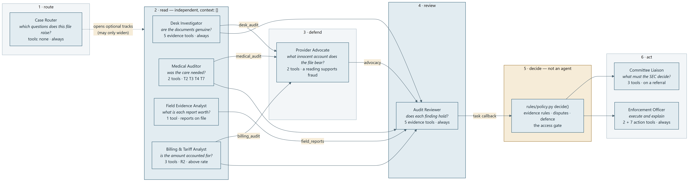

<details><summary>Mermaid source (the figure is rendered from this)</summary>

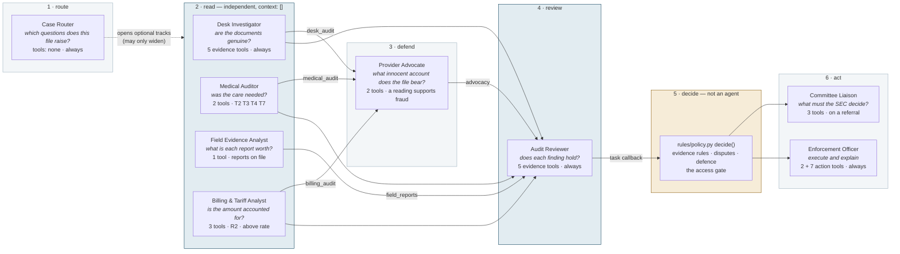
```mermaid
flowchart LR
    subgraph ROUTE["1 · route"]
        direction TB
        A0["Case Router<br/><i>which questions does this file raise?</i><br/>tools: none · always"]
    end

    subgraph READ["2 · read — independent, context: []"]
        direction TB
        A1["Desk Investigator<br/><i>are the documents genuine?</i><br/>5 evidence tools · always"]
        A2["Medical Auditor<br/><i>was the care needed?</i><br/>2 tools · T2 T3 T4 T7"]
        A3["Field Evidence Analyst<br/><i>what is each report worth?</i><br/>1 tool · reports on file"]
        A4["Billing &amp; Tariff Analyst<br/><i>is the amount accounted for?</i><br/>3 tools · R2 · above rate"]
    end

    subgraph DEFEND["3 · defend"]
        direction TB
        A5["Provider Advocate<br/><i>what innocent account does the file bear?</i><br/>2 tools · a reading supports fraud"]
    end

    subgraph REVIEW["4 · review"]
        direction TB
        A6["Audit Reviewer<br/><i>does each finding hold?</i><br/>5 evidence tools · always"]
    end

    subgraph DECIDE["5 · decide — not an agent"]
        direction TB
        POL["rules/policy.py decide()<br/>evidence rules · disputes · defence<br/>the access gate"]
    end

    subgraph ACT["6 · act"]
        direction TB
        A7["Committee Liaison<br/><i>what must the SEC decide?</i><br/>3 tools · on a referral"]
        A8["Enforcement Officer<br/><i>execute and explain</i><br/>2 + 7 action tools · always"]
    end

    A0 -.->|"opens optional tracks<br/>(may only widen)"| READ
    A1 -->|desk_audit| A5
    A2 -->|medical_audit| A5
    A4 -->|billing_audit| A5
    A1 --> A6
    A2 --> A6
    A3 -->|field_reports| A6
    A4 --> A6
    A5 -->|advocacy| A6
    A6 -->|"task callback"| POL
    POL --> A7
    POL --> A8

    style ROUTE fill:#f3f6f8,stroke:#9fb3c0
    style READ fill:#e2ecf1,stroke:#12455f
    style DEFEND fill:#f3f6f8,stroke:#9fb3c0
    style REVIEW fill:#e2ecf1,stroke:#12455f
    style DECIDE fill:#f6ecd8,stroke:#8f6212
    style ACT fill:#f3f6f8,stroke:#9fb3c0
```

</details>

**What to notice in the graph.** The four reading tasks have **no incoming context edge**: that is independence
expressed in configuration, not in a prompt. Every reading edge is labelled with the name the receiving agent reads
it by (`desk_audit`, `medical_audit`, `billing_audit`, `field_reports`, `advocacy`), so a finding can be disputed by
name. Nothing flows from an agent to an action: the only path to `ACT` is through the policy.

| Task | Agent | Runs | `context` | Guardrail | Callback |
|---|---|---|---|---|---|
| `route` | Case Router | always | — | plan names real tracks, reasons given, no field track without reports | records the plan |
| `investigate` | Desk Investigator | always | — | stance must cite; cross-claim stance needs the claims examined | records the reading |
| `medical_audit` | Medical Auditor | clinical trigger / router | — | same, plus T7 needs the admissions read | records the reading |
| `field_review` | Field Evidence Analyst | reports on file | — | one assessment per report, channels as named | records the weighing |
| `billing_audit` | Billing & Tariff Analyst | R2, above rate, router | — | stance needs `claim_tariff` called first | records the reading |
| `advocacy` | Provider Advocate | a reading supports fraud / router | the four readings | an unexcluded defence must cite and must have read the file | records the defence |
| `review` | Audit Reviewer | always | all five findings | disputes name findings on this case; the summary may not assert what the list omits | **the policy decides** |
| `committee_brief` | Committee Liaison | referral to the SEC | — | the brief passes the publication checks | records the brief |
| `enforce` | Enforcement Officer | always | — | the action tool refuses any action but the policy's | records the action |

## 4b. Which agent may call which tool

Capability is granted per agent in `crew/agent_tools.py` (`_kit`), not by instruction — an agent cannot call a tool
it was not given, and every call is recorded against the agent that made it.

| Tool | Router | Desk | Medical | Field | Billing | Advocate | Reviewer | Liaison | Officer |
|---|:--:|:--:|:--:|:--:|:--:|:--:|:--:|:--:|:--:|
| `beneficiary_claim_history` | | ● | ● | | ● | | ● | | |
| `documents_shared_with_other_claims` | | ● | | | | | ● | | |
| `surgeon_same_day_claims` | | ● | | | | | ● | | |
| `read_document` | | ● | ● | ● | ● | ● | ● | | |
| `compare_documents` | | ● | | | | | ● | | |
| `claim_tariff` | | | | | ● | ● | | | |
| `enforcement_decision` | | | | | | | | ● | ● |
| `access_impact` — *the only access data in the crew* | | | | | | | | ● | ● |
| `file_committee_brief` | | | | | | | | ● | |
| the 7 action tools | | | | | | | | | ● |

Three things this table is meant to show. **The Case Router holds nothing**, because a router that has read the file
has already formed the reading. **`access_impact` sits only with the two agents that act**, so no one who judges
whether fraud happened can know who depends on the hospital. **Only the officer can act at all**, and each of its
seven action tools executes exactly one action and refuses unless that action is the policy's.

## 4c. How one task is actually executed

The loop below is CrewAI's native tool-calling loop (`CrewAgentExecutor`), with this project's two additions: a
**guardrail** that must pass before the output counts, and a **callback** that records it. It is the same loop for
all nine agents.

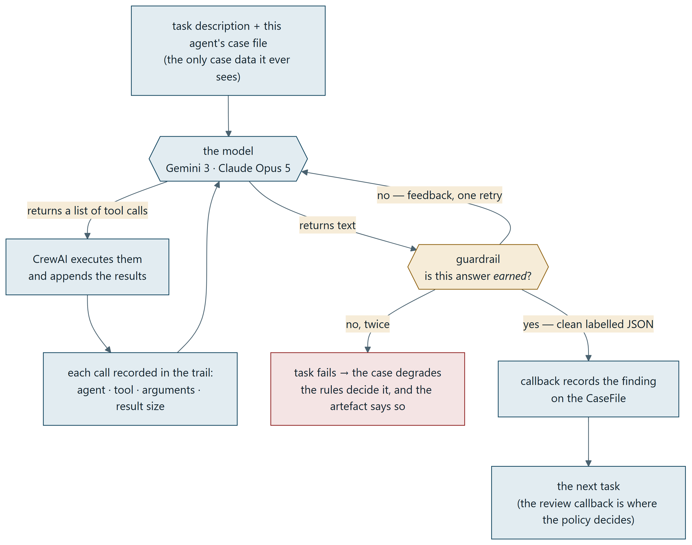

<details><summary>Mermaid source (the figure is rendered from this)</summary>

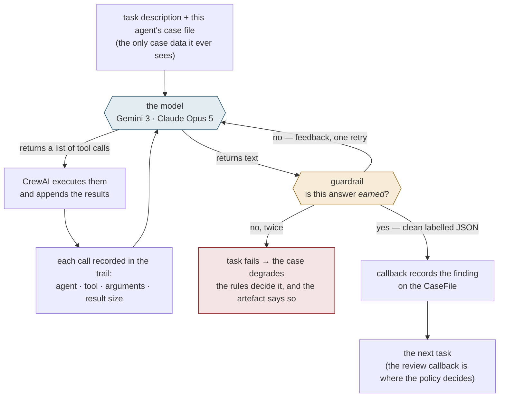
```mermaid
flowchart TD
    T["task description + this agent's case file<br/>(the only case data it ever sees)"] --> LLM
    LLM{{"the model<br/>Gemini 3 · Claude Opus 5"}}
    LLM -->|"returns a list of tool calls"| TOOLS["CrewAI executes them<br/>and appends the results"]
    TOOLS --> REC["each call recorded in the trail:<br/>agent · tool · arguments · result size"]
    REC --> LLM
    LLM -->|"returns text"| GRD{{"guardrail<br/>is this answer <i>earned</i>?"}}
    GRD -->|"no — feedback, one retry"| LLM
    GRD -->|"no, twice"| DEG["task fails → the case degrades<br/>the rules decide it, and the artefact says so"]
    GRD -->|"yes — clean labelled JSON"| CB["callback records the finding<br/>on the CaseFile"]
    CB --> NEXT["the next task<br/>(the review callback is where the policy decides)"]

    style LLM fill:#e2ecf1,stroke:#12455f
    style GRD fill:#f6ecd8,stroke:#8f6212
    style DEG fill:#f4e4e4,stroke:#8f2121
```

</details>

A tool refusal is not a failure: it is returned to the agent as the tool's result, and the refused call is kept in the
trail. That is how the officer learns that an action is not the policy's, and how an agent learns it may not read a
claim no tool has shown it.

## 4d. A real trace: every tool call on one case

Not an illustration. This is the investigation trail printed in `out_live/artefacts/escalate_to_sec_CASE-CLM-S02.md`,
from the live nine-agent run on `gemini-3.8-flash` (18 September) — the same fifteen calls, in the order the agents
made them.

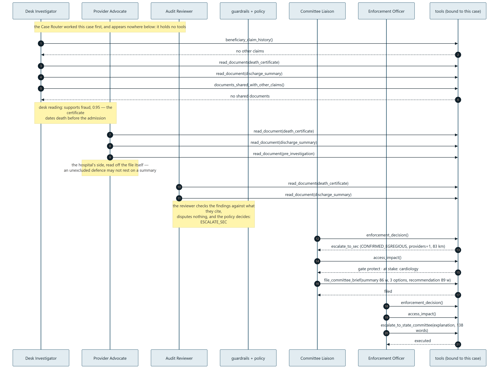

<details><summary>Mermaid source (the figure is rendered from this)</summary>

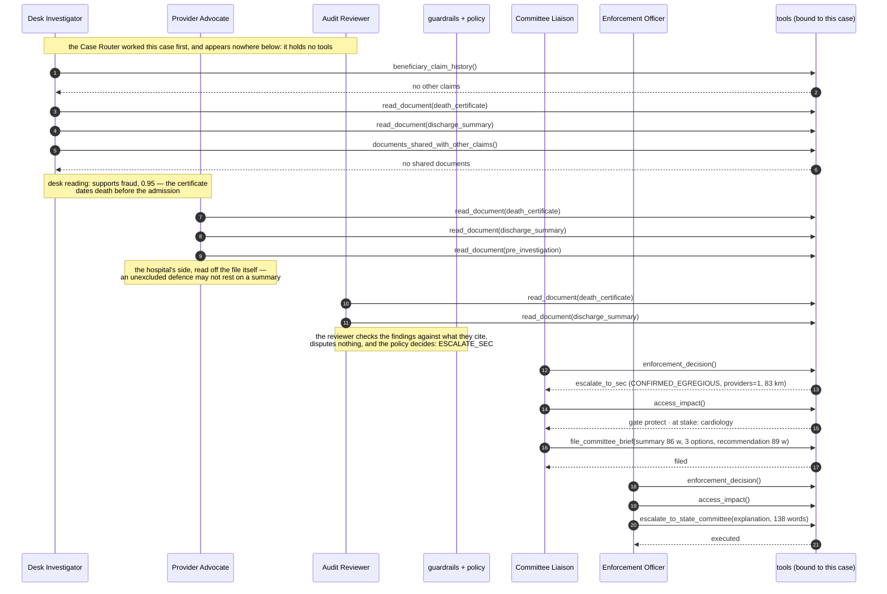
```mermaid
sequenceDiagram
    autonumber
    participant D as Desk Investigator
    participant A as Provider Advocate
    participant V as Audit Reviewer
    participant G as guardrails + policy
    participant L as Committee Liaison
    participant O as Enforcement Officer
    participant T as tools (bound to this case)

    Note over D,V: the Case Router worked this case first, and appears nowhere below: it holds no tools
    D->>T: beneficiary_claim_history()
    T-->>D: no other claims
    D->>T: read_document(death_certificate)
    D->>T: read_document(discharge_summary)
    D->>T: documents_shared_with_other_claims()
    T-->>D: no shared documents
    Note over D,A: desk reading: supports fraud, 0.95 — the certificate<br/>dates death before the admission
    A->>T: read_document(death_certificate)
    A->>T: read_document(discharge_summary)
    A->>T: read_document(pre_investigation)
    Note over A: the hospital's side, read off the file itself —<br/>an unexcluded defence may not rest on a summary
    V->>T: read_document(death_certificate)
    V->>T: read_document(discharge_summary)
    Note over V,G: the reviewer checks the findings against what they cite,<br/>disputes nothing, and the policy decides: ESCALATE_SEC
    L->>T: enforcement_decision()
    T-->>L: escalate_to_sec (CONFIRMED_EGREGIOUS, providers=1, 83 km)
    L->>T: access_impact()
    T-->>L: gate protect · at stake: cardiology
    L->>T: file_committee_brief(summary 86 w, 3 options, recommendation 89 w)
    T-->>L: filed
    O->>T: enforcement_decision()
    O->>T: access_impact()
    O->>T: escalate_to_state_committee(explanation, 138 words)
    T-->>O: executed
```

</details>

**Why this figure is worth a slide.** It is the answer to "did the agents actually do anything?" — three different
agents read the same death certificate for three different reasons (to judge it, to argue against it, to check the
judgement), the liaison and the officer read the decision rather than forming one, and the only write in the whole
trace is the last call. Every artefact in `out/` carries its own version of this table, and the decision log keeps
the same calls in brief (`tools_called`).

---

## 5. Decision boundary ★

**The second diagram for the deck.** It is the argument, drawn.

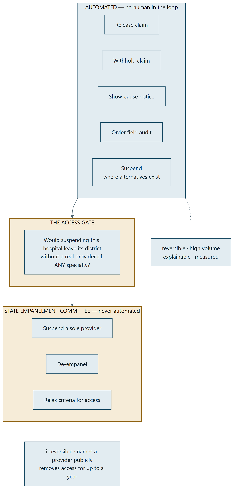

<details><summary>Mermaid source (the figure is rendered from this)</summary>

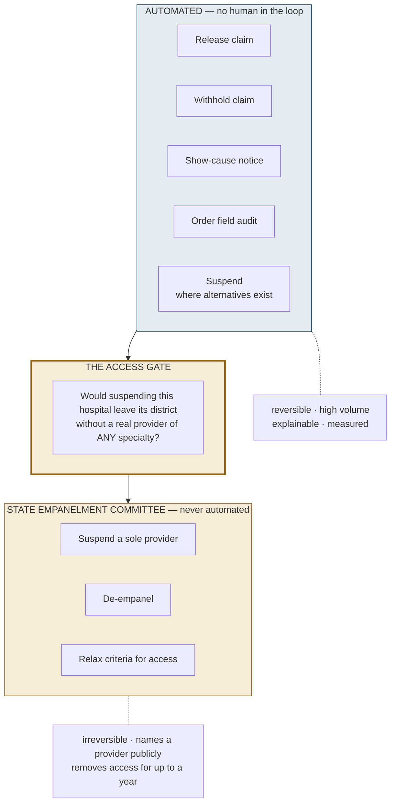
```mermaid
flowchart TB
    subgraph AUTO["AUTOMATED — no human in the loop"]
        direction LR
        A1["Release claim"]
        A2["Withhold claim"]
        A3["Show-cause notice"]
        A4["Order field audit"]
        A5["Suspend<br/>where alternatives exist"]
    end

    subgraph GATE["THE ACCESS GATE"]
        G["Would suspending this hospital leave its district<br/>without a real provider of ANY specialty?"]
    end

    subgraph HUMAN["STATE EMPANELMENT COMMITTEE — never automated"]
        direction LR
        H1["Suspend a sole provider"]
        H2["De-empanel"]
        H3["Relax criteria for access"]
    end

    AUTO --> GATE --> HUMAN

    N1["reversible · high volume<br/>explainable · measured"]
    N2["irreversible · names a provider publicly<br/>removes access for up to a year"]

    AUTO -.- N1
    HUMAN -.- N2

    style AUTO fill:#e2ecf1,stroke:#12455f
    style GATE fill:#f6ecd8,stroke:#8f6212,stroke-width:3px
    style HUMAN fill:#f6ecd8,stroke:#8f6212
```

</details>

**The boundary is not our judgement.** NHA's guidelines reserve criteria relaxation for prior NHA
approval and de-empanelment for the SEC. We implement the client's policy and supply the number it
never defined.

---

## 6. Data flow and provenance

Green is real. Amber is simulated. Note how little is amber, and where it sits.

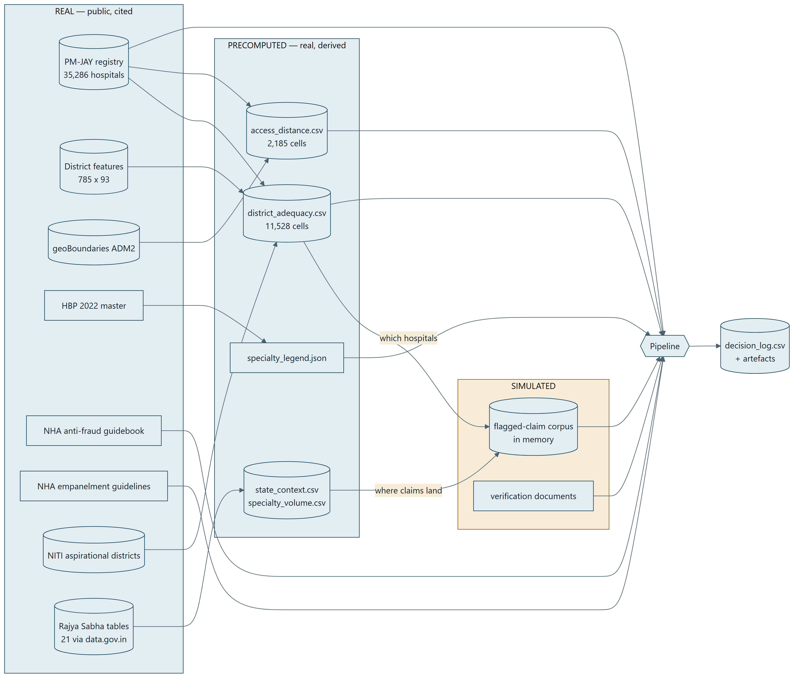

<details><summary>Mermaid source (the figure is rendered from this)</summary>

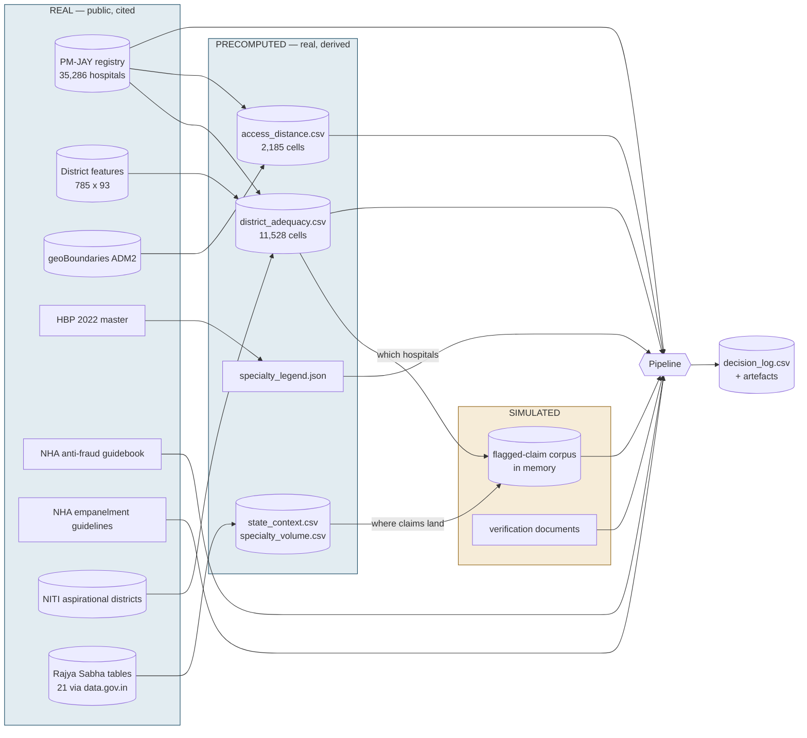
```mermaid
flowchart LR
    subgraph REAL["REAL — public, cited"]
        R1[("PM-JAY registry<br/>35,286 hospitals")]
        R2[("District features<br/>785 x 93")]
        R3[("geoBoundaries ADM2")]
        R4["HBP 2022 master"]
        R5["NHA anti-fraud guidebook"]
        R6["NHA empanelment guidelines"]
        R7[("NITI aspirational districts")]
        R8[("Rajya Sabha tables<br/>21 via data.gov.in")]
    end

    subgraph PRE["PRECOMPUTED — real, derived"]
        P1[("district_adequacy.csv<br/>11,528 cells")]
        P2[("access_distance.csv<br/>2,185 cells")]
        P3["specialty_legend.json"]
        P4[("state_context.csv<br/>specialty_volume.csv")]
    end

    subgraph SIM["SIMULATED"]
        S1[("flagged-claim corpus<br/>in memory")]
        S2["verification documents"]
    end

    PIPE{{"Pipeline"}}
    OUT[("decision_log.csv<br/>+ artefacts")]

    R1 --> P1
    R1 --> P2
    R3 --> P2
    R2 --> P1
    R7 --> P1
    R4 --> P3
    R8 --> P4
    P4 -->|where claims land| S1
    P1 -->|which hospitals| S1

    P1 --> PIPE
    P2 --> PIPE
    P3 --> PIPE
    R1 --> PIPE
    R5 --> PIPE
    R6 --> PIPE
    S1 --> PIPE
    S2 --> PIPE
    PIPE --> OUT

    style REAL fill:#e2ecf1,stroke:#12455f
    style PRE fill:#e2ecf1,stroke:#12455f
    style SIM fill:#f6ecd8,stroke:#8f6212
```

</details>

**Everything the argument depends on is real.** The simulated layer is the claim record and its
attachments — the thing flowing *through* the pipeline, which Step 3a explicitly permits.

---

## 7. Build order and dependencies

Do not deviate. This ordering is what makes the degraded path real rather than mocked.

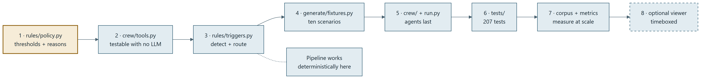

<details><summary>Mermaid source (the figure is rendered from this)</summary>

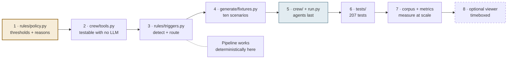
```mermaid
flowchart LR
    S1["1 · rules/policy.py<br/>thresholds + reasons"]
    S2["2 · crew/tools.py<br/>testable with no LLM"]
    S3["3 · rules/triggers.py<br/>detect + route"]
    S4["4 · generate/fixtures.py<br/>ten scenarios"]
    S5["5 · crew/ + run.py<br/>agents last"]
    S6["6 · tests/<br/>207 tests"]
    S8["7 · corpus + metrics<br/>measure at scale"]
    S7["8 · optional viewer<br/>timeboxed"]

    S1 --> S2 --> S3 --> S4 --> S5 --> S6 --> S8 --> S7

    D1["Pipeline works<br/>deterministically here"]
    S3 -.- D1

    style S1 fill:#f6ecd8,stroke:#8f6212,stroke-width:2px
    style S5 fill:#e2ecf1,stroke:#12455f
    style S7 stroke-dasharray: 5 5
```

</details>

By the end of step 4 the pipeline produces decisions with **no LLM at all**. Agents are added on top
of a working system, which is why a failing agent degrades instead of blocking.

---

## 8. Team workflow

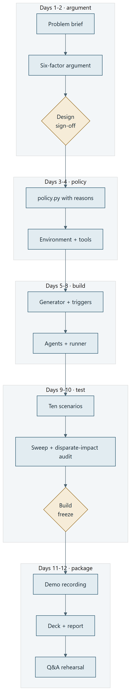

<details><summary>Mermaid source (the figure is rendered from this)</summary>

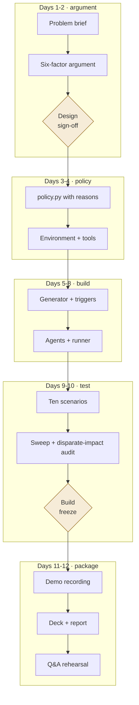
```mermaid
flowchart TD
    subgraph D12["Days 1-2 · argument"]
        W1["Problem brief"]
        W2["Six-factor argument"]
        W3{"Design<br/>sign-off"}
    end
    subgraph D34["Days 3-4 · policy"]
        W4["policy.py with reasons"]
        W5["Environment + tools"]
    end
    subgraph D58["Days 5-8 · build"]
        W6["Generator + triggers"]
        W7["Agents + runner"]
    end
    subgraph D910["Days 9-10 · test"]
        W8["Ten scenarios"]
        W9["Sweep + disparate-impact audit"]
        W10{"Build<br/>freeze"}
    end
    subgraph D1112["Days 11-12 · package"]
        W11["Demo recording"]
        W12["Deck + report"]
        W13["Q&A rehearsal"]
    end

    W1 --> W2 --> W3 --> W4 --> W5 --> W6 --> W7 --> W8 --> W9 --> W10 --> W11 --> W12 --> W13

    style W3 fill:#f6ecd8,stroke:#8f6212
    style W10 fill:#f6ecd8,stroke:#8f6212
```

</details>

**Two hard gates.** No code before design sign-off. No new features after the build freeze.
