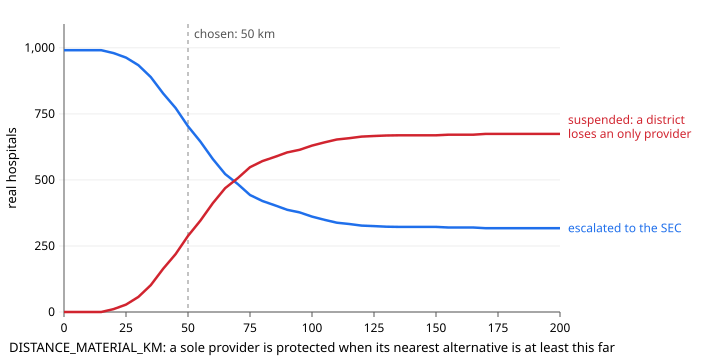

# 09 · Evaluation — the numbers beyond pass/fail

> **Generated by `python -m metrics.run` — do not edit by hand.** Re-run it after any change to the
> policy, triggers or data, and commit the result with the code that produced it.
> Corpus: 5,000 flagged cases, seed 20260916. Every case ran through the real pipeline
> (`crew.run.process`, rules path); cases ordered to the field re-entered with simulated field reports.

The ten scenarios (docs/05-TEST-PLAN.md §2) prove each path works. This document measures **how often**
each path is taken when flags arrive in realistic proportions, what that means at national scale, what the
evaluation forced us to change, and how much rests on assumptions.

**What this does not measure: the agents.** The corpus documents are neutral by design, so every desk reading here
is the rules path's. They measure the policy and the access gate, which decide identically on both paths. Whether the
crew reads documents better or worse than the rules is measured in
[10-AGENT-EVALUATION](10-AGENT-EVALUATION.md), on 40 cases whose truth is in the text.

---

## 1. Headline

| | |
|---|---|
| **Auto-resolution share** — flags that reached a final action with no human | **86.7%** |
| Resolved at the desk, no field work | 56.5% |
| Needed a field audit first | 43.5% |
| Went to a human (SEC escalation, de-listing referral, or review) | 13.3% |
| Innocent flags released | 68.2% |
| Innocent flags given a show-cause notice (reversible; 5 days to answer) | 17.1% |
| **Innocent flags suspended** | **0.63%** |
| Frauds enforced against (notice, suspension, escalation or de-listing referral) | 80.4% |
| Frauds released | 3.3% |

**At national scale** — 2024-25: 18,249,611 admissions; 0.18% fraud, 1% flag
false-positive rate, 90% recall → **211,732 flags a year, 580 a day**:

| Per year | |
|---|---|
| Field audits ordered | 92,019 |
| Human reviews, all kinds | 28,203 |
| Confirmed egregious findings (reach the access gate) | 8,215 |
| → escalated to State Empanelment Committees (exact, §4) | 889 |
| Suspensions | 7,538 |
| → of innocent hospitals | 1,016 |
| Show-cause notices | 64,663 (to innocent hospitals: 27,737) |

All counts are **claim-level**. Several flagged claims from one hospital become one hospital case, so
hospital-level workload is lower.

### The thesis, measured

Of confirmed egregious findings, **10.82%** land on a hospital whose suspension would leave its
district without a real provider of some specialty — suspension removes a hospital from every specialty it is
empanelled for, so the gate checks them all — and are escalated; **0.07%** are billed under a sole
listing whose facility tier makes it implausible (de-listing referral). Without the gate, every one of those
**10.89%** would have been suspended automatically, about
**895 a year**. A further **2.95%**
are suspended although the hospital is its district's only provider of something, because another provider is within
50 km (§4). Computed exactly from the allocation model (§2), not sampled.

Where those escalations land (50 km):

| State | SEC escalations / year | Share of the state's egregious findings escalated |
|---|---|---|
| Karnataka | 175 | 13.5% |
| Rajasthan | 116 | 17.4% |
| Madhya Pradesh | 111 | 19.3% |
| Chhattisgarh | 72 | 11.7% |
| Andhra Pradesh | 69 | 9.8% |
| Bihar | 63 | 21.4% |
| Uttar Pradesh | 55 | 6.7% |
| Maharashtra | 43 | 10.0% |
| Assam | 42 | 23.4% |
| Jharkhand | 36 | 25.2% |

---

## 2. The corpus — what is real and what is assumed

| Element | Source | Status |
|---|---|---|
| State of each claim | Admissions 2024-25 by state (Rajya Sabha) | **Real** |
| Specialty | Authorised admissions by specialty, answer of 30-06-2024 (4 specialties from the 2021 answer, scaled ×5.171) | **Real** |
| District within the state | weight = √(providers of the specialty) × √(population) | **Calibrated on real data** (below) |
| Hospital | Uniform among the district's registry providers of the specialty | Real frame, assumed rule |
| Package and amount | Published HBP package master | **Real** |
| Fraud share of flags (14.0%) | 0.18% base rate (PIB PRID 1847423), 1% FPR, 90% recall | Real rate; FPR and recall assumed |
| Which trigger a fraud or a false flag fires | Uniform — NHA publishes no breakdown | **Assumption** |
| Innocent explanation on file at the desk | 60% | **Assumption** — swept |
| Death certificate on file when billing after death is real | 80% | **Assumption** — swept |
| Field report points the right way | 85% | **Assumption** — swept |
| Field report confidence | uniform 0.60–0.95 | **Assumption** — swept |

**Nothing is trained on this corpus.** It is input data for measurement only.

### Why that district weight

District admissions in the two states that publish them, regressed (log-log) on registry hospitals and population:

| State | Admissions data | Districts matched | R² hospitals only | R² population only | R² both (fitted) | Fitted exponents (hospitals, population) | R² of the √×√ weight used |
|---|---|---|---|---|---|---|---|
| Uttar Pradesh | 2021-22 | 75 of 75 | 0.492 | 0.436 | 0.526 | 0.49, 0.45 | 0.526 |
| Gujarat | to Aug 2023 | 33 of 33 | 0.77 | 0.838 | 0.862 | 0.39, 0.77 | 0.856 |

In every state, hospitals and population together explain district admissions better than either alone (R² 0.526 against 0.492 (hospitals) and 0.436 (population) in Uttar Pradesh; R² 0.862 against 0.77 (hospitals) and 0.838 (population) in Gujarat). The fitted exponents (hospitals, population) are 0.49 and 0.45 in Uttar Pradesh; 0.39 and 0.77 in Gujarat. The generator is fitted to neither state: it uses the square-root weight (0.5, 0.5), whose R² is 0.526 in Uttar Pradesh; 0.856 in Gujarat.

---

## 3. Outcomes by trigger

| Trigger | Cases | Fraud | Field audit | Released | Show-cause | Suspended | Escalated | De-listing referral | Human review |
|---|---|---|---|---|---|---|---|---|---|
| T2 | 548 | 12.8% | 49.1% | 75.2% | 8.4% | 0.0% | 0.0% | 0.0% | 16.4% |
| T3 | 548 | 12.8% | 44.9% | 78.6% | 11.1% | 0.0% | 0.0% | 0.0% | 10.2% |
| T4 | 548 | 12.8% | 0.0% | 51.6% | 48.4% | 0.0% | 0.0% | 0.0% | 0.0% |
| T5 | 548 | 12.8% | 100.0% | 59.5% | 0.0% | 9.9% | 1.1% | 0.0% | 29.6% |
| T6 | 70 | 100.0% | 100.0% | 0.0% | 0.0% | 67.1% | 5.7% | 0.0% | 27.1% |
| T7 | 548 | 12.8% | 100.0% | 54.7% | 13.7% | 0.0% | 0.0% | 0.0% | 31.6% |
| T10 | 548 | 12.8% | 89.8% | 57.5% | 0.0% | 14.1% | 1.1% | 0.0% | 27.4% |
| R1 | 548 | 12.8% | 0.0% | 0.0% | 100.0% | 0.0% | 0.0% | 0.0% | 0.0% |
| R2 | 547 | 12.6% | 0.0% | 51.6% | 48.4% | 0.0% | 0.0% | 0.0% | 0.0% |
| R3 | 547 | 12.6% | 0.0% | 51.2% | 48.8% | 0.0% | 0.0% | 0.0% | 0.0% |

The desk settles what documents can settle: T4, R1–R3, and T10 when a death certificate dates the death before
admission. What only a person on the ground can resolve (T5, T7, T2/T3 with no discharge explanation, T10 on a
register entry alone) goes to the field first — and so does T6: the desk finds the reused document, but suspension
waits for a hospital visit and a beneficiary call, because at the desk reuse and a clerical upload error look the
same. That is the branching the design promised, at volume.

---

## 4. Threshold sweep — why 50 km

`DISTANCE_MATERIAL_KM` decides when a sole provider is protected: **protected if its nearest alternative is at
least this far away**. At 0 km every sole provider is protected; raising the threshold protects fewer.

The left columns take **every real hospital that is its district's only provider of some specialty, or one of two in
a NITI aspirational district**, and ask what the gate would do if it were confirmed to have committed egregious fraud
in a specialty it can plausibly deliver — no simulation. Suspension removes a hospital from every specialty it is
empanelled for, so a hospital is escalated if losing it would strip **any** of its specialties of their only real
provider. The right columns weight the same question by where claims actually arrive (§2) and scale it to confirmed
egregious findings per year.

| km | Hospitals escalated | Hospitals suspended, removing an only provider | Cells losing their only provider | Districts losing a specialty | Population of those districts (M) | SEC escalations / year | Suspensions removing an only provider / year |
|---|---|---|---|---|---|---|---|
| 0 | 991 | 0 | 0 | 0 | 0.0 | 1,131 | 0 |
| 25 | 963 | 28 | 87 | 22 | 29.3 | 1,106 | 25 |
| 50 | 703 | 288 | 718 | 189 | 262.2 | 889 | 242 |
| 75 | 443 | 548 | 1,316 | 339 | 540.2 | 570 | 561 |
| 100 | 361 | 630 | 1,559 | 390 | 652.0 | 412 | 719 |
| 150 | 322 | 669 | 1,675 | 407 | 682.9 | 313 | 818 |
| 200 | 317 | 674 | 1,691 | 411 | 689.9 | 292 | 839 |

- At **0 km**, 991 hospitals would be escalated and no suspension would remove a district's only provider.
- At **50 km**, 703 are escalated; 288 would be
  suspended, removing the only provider of 718 district × specialty cells in
  189 districts — each with an alternative within 50 km.
- At **100 km**, escalations fall to 361, and suspensions would remove the only provider of
  1,559 cells in 390 districts (652.0 M people).
- Even at **200 km**, 317 hospitals stay protected: the aspirational-district rule and sole
  providers with no alternative anywhere are protected at every threshold.

**The operating point is a policy choice, not a statistical one.** Each kilometre added to the threshold
protects fewer districts and saves Committee time; this table is the price list. 50 km is the median distance
to an alternative (50.7 km), so it splits sole-provider cells roughly in half — a defensible default for a
Committee to move, not a finding.

---

## 5. Disparate-impact audit

| Hospital type | Network share | Sole-provider share | Cases | Auto-resolved | To a human | Suspended | Show-cause | Innocent flags given an adverse action | Egregious findings escalated (exact) |
|---|---|---|---|---|---|---|---|---|---|
| Public | 54.6% | 65.3% | 2110 | 85.0% | 15.0% | 3.7% | 28.8% | 15.7% | 11.26% |
| Private(For Profit) | 40.7% | 26.1% | 2561 | 88.0% | 12.0% | 3.4% | 32.4% | 19.4% | 8.45% |
| Private(Not For Profit) | 4.1% | 7.1% | 236 | 89.4% | 10.6% | 3.8% | 27.1% | 17.7% | 11.14% |
| GOI | 0.6% | 1.6% | 87 | 83.9% | 16.1% | 3.5% | 28.7% | 21.4% | 53.06% |

Claims are placed by where admissions happen, not by hospital type, so differences between types come from
**where each type sits in the network**. Public hospitals and not-for-profits hold more sole-provider slots than
their network share, so more of their egregious findings are escalated rather than suspended (last column, exact).
R3 (government-reserved packages) can only fire on private hospitals, which raises their show-cause share.
**The gate is ownership-blind; its effects are not.** We report both.

**Official context.** De-empanelments from 2018-19 to 2024-25 fell on **2,132 private and 150
public hospitals (6.6% public)**, although public hospitals are 55% of the network.
Private hospitals also hold 33.2% of sole-provider slots. The published de-empanelment guidance we
reviewed sets no check on what a de-empanelment does to access; the gate adds one that applies to every owner.

---

## 6. What the evaluation forced us to change

The first run of this corpus found two ways the system suspended innocent hospitals. Both are fixed in the
code; the table re-runs the same corpus with each fix switched off.

- **E-1 · A register entry treated as proof.** The desk read a date in the death register that preceded
  admission as 0.95-confidence fraud. A register error therefore produced a suspension with no one checking.
  NHA's own checklist for trigger 10 verifies the mismatch by asking the relatives and for the death certificate.
  **Now:** with a certificate on file the desk still decides (S1, S2 and S9 are unchanged); without one, the case goes to the field.
- **E-2 · One field report could suspend a hospital.** Egregious triggers ordered a single field channel, so one
  wrong report above the confidence floor was enough. **Now:** every egregious trigger orders two independent
  channels (the guidebook lists both for T6 and T10); a disagreement falls below the floor and goes to a human.
  Locked by `test_no_single_field_report_can_suspend_a_hospital`.

| Variant | Auto-resolved | To a human | Innocent flags suspended | Innocent T10 flags suspended | Frauds enforced | Wrongful suspensions / year | Human reviews / year |
|---|---|---|---|---|---|---|---|
| As first built: a death-register entry is proof; one field channel | 88.8% | 11.2% | 11.3% | 88.3% | 82.5% | 18,251 | 23,799 |
| E-1 fixed: a register entry without a certificate is a lead | 87.0% | 13.0% | 1.4% | 9.6% | 82.0% | 2,329 | 27,568 |
| E-1 + E-2 fixed: egregious triggers order two field channels (current) | 86.7% | 13.3% | 0.6% | 3.1% | 80.4% | 1,016 | 28,203 |

Together the two changes cut wrongful suspensions from **18,251** to **1,016 a year**, while frauds enforced moved from 82.5% to 80.4% and human reviews from 23,799 to 28,203. That is the trade: fewer innocent hospitals suspended, paid for in human review.

---

## 7. Sensitivity — how much rests on the assumptions

One assumption varied at a time; everything else at baseline; same seed.

| Assumption | Value | Fraud share of flags | Auto-resolved | At desk | Field audit | To a human | Innocent: notice | Innocent: suspended | Fraud enforced | Fraud released | Flags / yr | Human / yr | Wrongful susp. / yr |
|---|---|---|---|---|---|---|---|---|---|---|---|---|---|
| baseline | - | 14.0% | 86.7% | 56.5% | 43.5% | 13.3% | 17.1% | 0.63% | 80.4% | 3.3% | 211,732 | 28,203 | 1,016 |
| fpr | 0.005 | 24.5% | 85.8% | 54.9% | 45.0% | 14.2% | 16.8% | 0.57% | 81.4% | 3.2% | 120,648 | 17,108 | 458 |
| fpr | 0.02 | 7.5% | 86.6% | 56.9% | 43.0% | 13.4% | 17.4% | 0.49% | 81.3% | 3.5% | 393,900 | 52,940 | 1,576 |
| fpr | 0.05 | 3.1% | 86.7% | 56.9% | 43.0% | 13.3% | 18.3% | 0.28% | 81.5% | 4.5% | 940,402 | 124,697 | 2,257 |
| p_explained | 0.3 | 14.0% | 84.7% | 50.7% | 49.3% | 15.3% | 28.4% | 0.63% | 80.4% | 3.3% | 211,732 | 32,437 | 1,016 |
| p_explained | 0.9 | 14.0% | 88.1% | 61.8% | 38.2% | 11.9% | 5.1% | 0.63% | 80.4% | 3.3% | 211,732 | 25,154 | 1,016 |
| field_accuracy | 0.7 | 14.0% | 82.5% | 56.5% | 43.5% | 17.5% | 19.2% | 2.28% | 71.2% | 6.7% | 211,732 | 37,011 | 3,684 |
| field_accuracy | 0.95 | 14.0% | 90.8% | 56.5% | 43.5% | 9.2% | 16.0% | 0.08% | 88.7% | 0.9% | 211,732 | 19,522 | 127 |
| field_conf | (0.5, 0.85) | 14.0% | 78.0% | 56.5% | 43.5% | 22.0% | 16.5% | 0.44% | 73.2% | 2.3% | 211,732 | 46,539 | 720 |
| field_conf | (0.75, 0.95) | 14.0% | 92.4% | 56.5% | 43.5% | 7.6% | 17.8% | 0.63% | 86.8% | 4.6% | 211,732 | 16,049 | 1,016 |
| p_certificate | 0.5 | 14.0% | 86.5% | 56.1% | 43.9% | 13.5% | 17.1% | 0.63% | 79.1% | 3.4% | 211,732 | 28,541 | 1,016 |
| p_certificate | 1.0 | 14.0% | 86.7% | 56.7% | 43.2% | 13.3% | 17.1% | 0.63% | 81.0% | 3.1% | 211,732 | 28,076 | 1,016 |

Across every sweep, auto-resolution stays between **78.0%** and **92.4%**; the assumption that moves it most is `field_conf`, because field reports near the 0.7 confidence floor go to a human. **Wrongful suspensions are most sensitive to `field_accuracy`**: 127 a year at `field_accuracy=0.95`, 3,684 at `field_accuracy=0.7`. The safety of automatic suspension rests on the quality of field verification more than on anything in this code — which is why two independent channels are required.

**Known limitations**

1. **T6 is assumed never to fire innocently.** A clerical mix-up that filed one patient's discharge summary
   under another reads as document reuse. It is no longer suspended at the desk, but it costs a hospital visit
   and a beneficiary call, and two wrong field reports could still suspend.
2. **Uniform trigger mixes.** NHA publishes no breakdown of fraud or false flags by trigger. A different mix
   moves the auto-resolution share; §3 shows which way.
3. **Field reports are modelled, not observed.** Their confidence relative to the 0.7 floor sets
   the human-review share almost directly.
4. **Frauds the triggers never flag (10% by assumption) are outside this system and these numbers.**
5. **Claim-level, not hospital-level.** Repeat offenders collapse into single hospital cases in practice.
6. **R2's desk rule accepts an implant invoice as the explanation for any package.** The package master has no clean
   implant flag to restrict it to (its "barcode" requirements mean drug barcodes as often as implants), so an
   invoice on a package that uses no implant would still clear an amount above the rate.

---

## 8. Official context used above

| Figure | Value | Source |
|---|---|---|
| Hospital admissions 2024-25 | 18,249,611 (Rs 28,714.9 crore; average Rs 15,735) | Rajya Sabha answer |
| Expected confirmed frauds a year at 0.18% | 32,849 (90 a day) | PIB 1847423 × admissions |
| Innocent share of flags at 1% FPR, 90% recall | 86.0% | arithmetic |
| Empanelled hospitals, 01-03-2025 | 30,957 | Rajya Sabha answer |
| Our registry export, PMJAY scope | 31,196 (+0.8%; 21 of 36 states exact, 30 within 10) | hospitals.pmjay.gov.in |
| De-empanelled 2018-19 to 2024-25 | 2,132 private, 150 public | Rajya Sabha answer |
| Largest single state-year | 286 hospitals, Madhya Pradesh, 2024-25 | Rajya Sabha answer |
| Hospitals that opted out, 2019-20 to 2024-25 | 609 | Rajya Sabha answer |
| Claims found non-admissible for abuse, misuse or incorrect entries, private hospitals, to 14-01-2025 | Rs 562.4 crore across 23 states; Uttar Pradesh, Chhattisgarh, Madhya Pradesh = 67.3% | Rajya Sabha answer |
| …as a share of claim value, states over Rs 1,000 crore | 0.0% (Maharashtra) to 1.584% (Uttar Pradesh) | derived |
| Beneficiaries linked to a single mobile number, 2018-21 | 777,463 | Rajya Sabha answer |
| Bahraich admissions, 2021-22 | 8,990 (UP district median 4,741) | Rajya Sabha answer |
